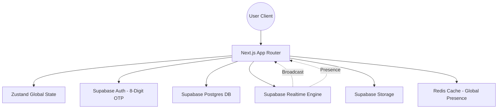

# Nexora — Technical Architecture & Documentation
**Version:** 2.1.0  
**Status:** Official Technical Reference  
**Subject:** High-Fidelity Messaging Infrastructure  

---

## 1. Executive Summary
Nexora is a premium, high-fidelity messaging platform designed to provide a "scroll-free," atmospheric user experience. By leveraging an event-driven architecture and a glassmorphic design system, Nexora bridges the gap between traditional chat applications and high-end interactive interfaces. This document outlines the technical specifications, security protocols, and operational workflows of the platform.

## 2. System Architecture
Nexora utilizes a decentralized event-driven architecture powered by **Next.js 16** and **Supabase**. The system is designed for sub-100ms latency in message delivery and real-time state synchronization.

## 3. Technology Stack
| Layer | Technology | Details |
| :--- | :--- | :--- |
| **Frontend Framework** | Next.js 16 | React 19, Server Components, App Router |
| **Styling Engine** | Tailwind CSS v4 | Utility-first with custom glassmorphic tokens |
| **Animations** | Framer Motion | Physics-based micro-interactions |
| **State Management** | Zustand | Atomic global state for chat & auth |
| **Backend / BaaS** | Supabase | Postgres, Auth, Realtime, Edge Functions |
| **Real-time Core** | Postgres Changes + Broadcast | Multi-channel synchronization |
| **Data Persistence** | PostgreSQL | Relational schema with RLS enforcement |

## 4. Authentication & Security
### 4.1 8-Digit OTP Flow
Nexora implements a dual-layer authentication strategy to ensure user security without compromising the "low-friction" entry experience.

1.  **Stage 1 - Identification**: User submits Email, Password, and unique Username.
2.  **Stage 2 - Challenge**: Supabase Auth triggers an 8-digit verification code to the registered email.
3.  **Stage 3 - Verification**: The client must provide the `token` via the verified OTP interface.
4.  **Stage 4 - Profile Provisioning**: A Postgres trigger automatically generates a `profiles` record upon successful verification.

### 4.2 Row Level Security (RLS)
The database operates on a "Zero-Trust" model. No user has direct access to tables without explicit RLS policy matching.
- **Chats**: Users can only view chats where they are listed in `chat_participants`.
- **Messages**: Read access is restricted to members of the parent `chat_id`.
- **Profiles**: Publicly searchable via `username`, but sensitive fields are hidden from non-authenticated requests.

## 5. Core Workflow Implementations

### 5.1 Real-time Messaging Management
Messaging follows an **Optimistic UI pattern**. When a user sends a message:
1.  **Local Sync**: The message is instantly added to the Zustand store with a `sending` status.
2.  **Persistence**: The message is inserted into the Supabase `messages` table.
3.  **Broadcasting**: Supabase Realtime detects the change and broadcasts the payload to all active participants in that channel.
4.  **Confirmation**: The local UI transitions the status to `delivered`.

### 5.2 Group Management System
Groups are created via an atomic transaction (API Route) that:
- Initializes a `chats` record with `type: 'group'`.
- Assigns the creator as `role: 'admin'`.
- Bulk-inserts participants from the discovery list.
- Uploads and links the group icon to Supabase Storage.

### 5.3 Calendar & Scheduling
The `CalendarView` integrates global holiday data with user-defined events.
- **Persistence**: Events are stored in the `calendar_events` table.
- **Holiday Sync**: Uses the `date-holidays` engine for Indian Standard (IN) holidays, synchronized in real-time.
- **Persistence Logic**: CRUD operations on events trigger real-time updates across devices for the same user account.

## 6. UI/UX Design System
Nexora utilizes a custom design language centered around **Atmospheric Glassmorphism**.

### 6.1 Design Tokens
- **Surface**: `backdrop-blur-2xl`, `bg-surface-main/40`
- **Typography**: Inter (Body), Outfit/Font-Display (Headings)
- **Accents**: `primary-high` (Neon Indigo), `noir-accent` (Deep Orange)

### 6.2 Animation Principles
- **Enter/Exit**: All modals use `initial: { scale: 0.95, opacity: 0 }`.
- **Staggered Lists**: Chat items reveal with a 0.05s delay stagger for a premium "filling" effect.
- **Presence**: Typing indicators use a 3-dot pulse with custom cubic-bezier easing.

## 7. Performance Optimization
- **Parallel Initial State**: Profiles and Chat lists are fetched concurrently using `Promise.all` to reduce TTI (Time to Interactive).
- **Media Transcoding**: Images are served via Supabase Storage with optimized delivery paths.
- **Presence Debounce**: Typing indicators are debounced at 1000ms to reduce WebSocket overhead.

---
**Nexora Technologies**  
*Confidential — Engineering Reference*
